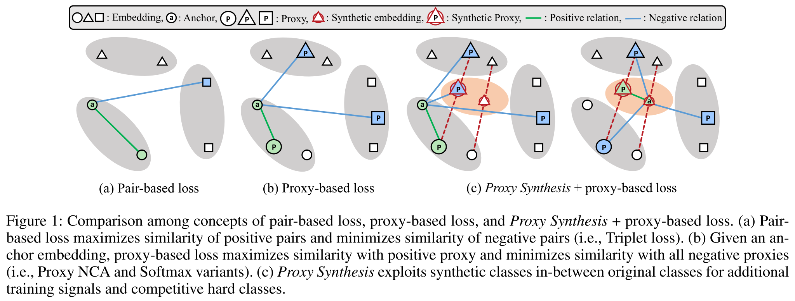
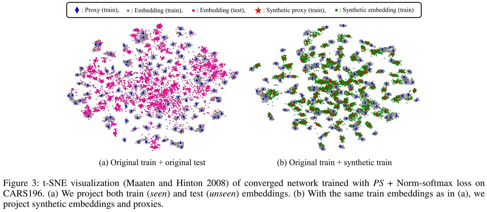
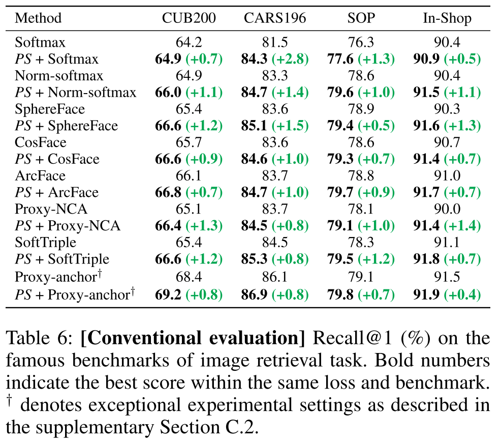
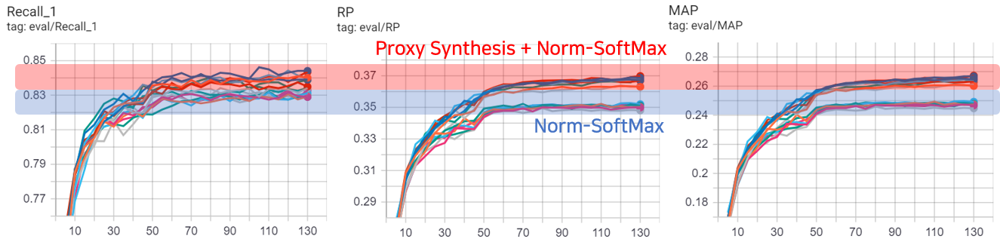

# Proxy Synthesis: Learning with Synthetic Classes for Deep Metric Learning

Official PyTorch implementation of *"Proxy Synthesis: Learning with Synthetic Classes for Deep Metric Learning"* (AAAI 2021)

**Geonmo Gu\*<sup>1</sup>, Byungsoo Ko\*<sup>1</sup>, Han-Gyu Kim<sup>2</sup>** (* Authors contributed equally.)

<sup>1</sup>@NAVER/LINE Vision, <sup>2</sup>@NAVER Clova Speech

- Paper(TBD) | Presentation Video(TBD) | PPT(TBD) | Poster(TBD)

## Overview

### Proxy Synthesis

- *Proxy Synthesis (PS)* is a novel regularizer for any softmax variants and proxy-based losses in deep metric learning.



### How it works?

- *Proxy Synthesis* exploits synthetic classes and improves generalization by considering class relations and obtaining smooth decision boundaries.
- Synthetic classes mimic unseen classes during training phase as described in below Figure.



### Experimental results

- *Proxy Synthesis* improves performance for every loss and benchmark dataset.

<p align="center">
  
</p>

## Getting Started

### Installation

1. Clone the repository locally
```bash
$ git clone https://github.com/navervision/proxy-synthesis
```

2. Create conda virtual environment
```bash
$ conda create -n proxy_synthesis python=3.7 anaconda
$ conda activate proxy_synthesis
```

3. Install pytorch
- [Install pytorch](https://pytorch.org/get-started/locally/) according to your CUDA version
```bash
$ conda install pytorch torchvision cudatoolkit=<YOUR_CUDA_VERSION> -c pytorch
```

4. Install faiss
- We use [faiss](https://github.com/facebookresearch/faiss) library for faster evaluation
- [Install faiss](https://github.com/facebookresearch/faiss/blob/master/INSTALL.md) according to your CUDA version
```bash
$ conda install faiss-gpu cudatoolkit=<YOUR_CUDA_VERSION> -c pytorch
```

5. Install requirements
```bash
$ pip install -r requirements.txt
```

### Prepare Data

- Download [CARS196](https://ai.stanford.edu/~jkrause/cars/car_dataset.html) dataset and unzip

```bash
$ wget http://imagenet.stanford.edu/internal/car196/car_ims.tgz
$ tar zxvf car_ims.tgz -C ./dataset
```

- Rearrange CARS196 directory by following structure
```
# Dataset structure
/dataset/carDB/
  train/
    class1/
      img1.jpeg
    class2/
      img2.jpeg
  test/
    class1/
      img3.jpeg
    class2/
      img4.jpeg
```

```bash
# Rearrange dataset structure
$ python dataset/prepare_cars.py
```

### Train models

#### Norm-SoftMax loss with CARS196

```bash
# Norm-SoftMax
$ python main.py --gpu=0 \
--save_path=./logs/CARS196_norm_softmax \
--data=./dataset/carDB --data_name=cars196 \
--dim=512 --batch_size=128 --epochs=130 \
--freeze_BN --loss=Norm_SoftMax \
--decay_step=50 --decay_stop=50 --n_instance=1 \
--scale=23.0 --check_epoch=5
```

#### PS + Norm-SoftMax loss with CARS196

```bash
# PS + Norm-SoftMax
$ python main.py --gpu=0 \
--save_path=./logs/CARS196_PS_norm_softmax \
--data=./dataset/carDB --data_name=cars196 \
 --dim=512 --batch_size=128 --epochs=130 \
--freeze_BN --loss=Norm_SoftMax \
--decay_step=50 --decay_stop=50 --n_instance=1 \
--scale=23.0 --check_epoch=5 \
--ps_alpha=0.40 --ps_mu=1.0
```

#### Proxy-NCA loss with CARS196

```bash
# Proxy-NCA
$ python main.py --gpu=0 \
--save_path=./logs/CARS196_proxy_nca \
--data=./dataset/carDB --data_name=cars196 \
--dim=512 --batch_size=128 --epochs=130 \
--freeze_BN --loss=Proxy_NCA \
--decay_step=50 --decay_stop=50 --n_instance=1 \
--scale=12.0 --check_epoch=5
```

#### PS + Proxy-NCA loss with CARS196

```bash
# PS + Proxy-NCA
$ python main.py --gpu=0 \
--save_path=./logs/CARS196_PS_proxy_nca \
--data=./dataset/carDB --data_name=cars196 \
--dim=512 --batch_size=128 --epochs=130 \
--freeze_BN --loss=Proxy_NCA \
--decay_step=50 --decay_stop=50 --n_instance=1 \
--scale=12.0 --check_epoch=5 \
--ps_alpha=0.40 --ps_mu=1.0
```

### Check Test Results
```
$ tensorboard --logdir=logs --port=10000
```

## Experimental results
- We report Recall@1, RP and MAP performances of each loss, which are trained with CARS196 dataset for 8 runs.

### Recall@1
Loss | 1 | 2 | 3 | 4 | 5 | 6 | 7 | 8 | Mean ± std
-- | -- | -- | -- | -- | -- | -- | -- | -- | --
Norm-SoftMax | 83.38 | 83.25 | 83.25 | 83.18 | 83.05 | 82.90 | 82.83 | 82.79 | 83.08 ± 0.21
PS + Norm-SoftMax | 84.69 | 84.58 | 84.45 | 84.35 | 84.22 | 83.95 | 83.91 | 83.89 | 84.25 ± 0.31
Proxy-NCA | 83.74 | 83.69 | 83.62 | 83.32 | 83.06 | 83.00 | 82.97 | 82.84 | 83.28 ± 0.36
PS + Proxy-NCA | 84.52 | 84.39 | 84.32 | 84.29 | 84.22 | 84.12 | 83.94 | 83.88 | 84.21 ± 0.21

### RP
Loss | 1 | 2 | 3 | 4 | 5 | 6 | 7 | 8 | Mean ± std
-- | -- | -- | -- | -- | -- | -- | -- | -- | --
Norm-SoftMax | 35.85 | 35.51 | 35.28 | 35.28 | 35.24 | 34.95 | 34.87 | 34.84 | 35.23 ± 0.34
PS + Norm-SoftMax | 37.01 | 36.98 | 36.92 | 36.74 | 36.74 | 36.73 | 36.54 | 36.45 | 36.76 ± 0.20
Proxy-NCA | 36.08 | 35.85 | 35.79 | 35.66 | 35.66 | 35.63 | 35.47 | 35.43 | 35.70 ± 0.21
PS + Proxy-NCA | 36.97 | 36.84 | 36.72 | 36.64 | 36.63 | 36.60 | 36.43 | 36.41 | 36.66 ± 0.18

### MAP
Loss | 1 | 2 | 3 | 4 | 5 | 6 | 7 | 8 | Mean ± std
-- | -- | -- | -- | -- | -- | -- | -- | -- | --
Norm-SoftMax | 25.56 | 25.56 | 25.00 | 24.93 | 24.90 | 24.59 | 24.57 | 24.56 | 24.92 ± 0.35
PS + Norm-SoftMax | 26.71 | 26.67 | 26.65 | 26.56 | 26.53 | 26.52 | 26.30 | 26.17 | 26.51 ± 0.18
Proxy-NCA | 25.66 | 25.52 | 25.37 | 25.36 | 25.33 | 25.26 | 25.22 | 25.04 | 25.35 ± 0.18
PS + Proxy-NCA | 26.77 | 26.63 | 26.50 | 26.42 | 26.37 | 26.31 | 26.25 | 26.12 | 26.42 ± 0.20

### Performance Graph
- Below figure shows performance graph of test set during training.


## Reference
- Our code is based on SoftTriple repository ([Arxiv](https://arxiv.org/abs/1909.05235), [Github](https://github.com/idstcv/SoftTriple))

## Citation
If you find *Proxy Synthesis* useful in your research, please consider to cite the following paper.

```
@inproceedings{gu2020proxy,
    title={Proxy Synthesis: Learning with Synthetic Classes for Deep Metric Learning},
    author={Geonmo Gu, Byungsoo Ko, and Han-Gyu Kim},
    booktitle={Proceedings of the AAAI Conference on Artificial Intelligence},
    year={2021}
}
```

## License

```
Copyright 2021-present NAVER Corp.

Licensed under the Apache License, Version 2.0 (the "License");
you may not use this file except in compliance with the License.
You may obtain a copy of the License at

    http://www.apache.org/licenses/LICENSE-2.0

Unless required by applicable law or agreed to in writing, software
distributed under the License is distributed on an "AS IS" BASIS,
WITHOUT WARRANTIES OR CONDITIONS OF ANY KIND, either express or implied.
See the License for the specific language governing permissions and
limitations under the License.
```   
